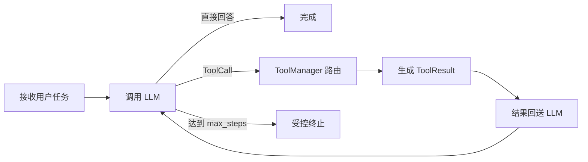

# M02 Agent Loop

## 里程碑目标

实现一个可验证的 Agent Runtime：模型可以直接回答，也可以请求一个或多个工具；工具结果回送模型，直到完成或命中明确终止条件。

## 必须交付

- `Agent` 只保存指令、LLM、工具和步数上限等配置。
- `Runner` 管理消息、步骤、工具调用和终止原因。
- `ToolManager` 负责 Schema 暴露、名称路由和结构化执行结果。
- 支持纯文本、单 Tool、多 Tool、未知 Tool、非法参数和 `max_steps`。
- 循环不能依赖打印内容判断是否结束。

## 代码入口

- `src/agent_from_scratch/agent.py`
- `src/agent_from_scratch/runner.py`
- `src/agent_from_scratch/tools.py`
- `src/agent_from_scratch/schemas.py`
- `tests/test_runner.py`

## Runtime 状态机



## 核心设计

### Agent 与 Runner 分工

`Agent` 是声明式配置，`Runner` 是有生命周期的执行器。这样同一 Agent 配置可以被 CLI、测试或未来服务端复用。

### Tool Calling 本质

模型输出的是结构化调用意图，不会执行 Python。Runtime 必须验证名称和参数、执行函数，再把 `ToolResult` 作为新输入续写。

### 多 Tool

一轮响应可能包含多个工具调用。Runner 按输出顺序执行并累积结果，不能只处理第一个调用。

### 明确终止

完成、拒绝、错误、达到步数上限都必须成为机器可读的 `finish_reason`。终止原因不是日志文本。

## 实作任务

1. 跟踪一次“计算 6 * 7”的完整消息与事件变化。
2. 用 `FakeLLM` 构造一轮两个 ToolCall 的响应。
3. 构造未知工具和达到 `max_steps` 的测试。
4. 解释为什么 Tool 异常不应直接让整个 Python 进程崩溃。

## 自动验证

```powershell
cd agent-from-scratch
python -m pytest -q tests/test_runner.py tests/test_tools.py
python examples/offline_demo.py
```

## 常见失败

- 把 Loop 写进 `Agent`，让配置对象承担运行状态。
- 只判断 `content` 是否为空，遗漏同轮 ToolCall。
- 工具不存在时抛出未捕获异常。
- 没有 `max_steps`，模型可无限请求工具。
- 用字符串拼接伪造供应商续写协议。

## 完成定义

所有终止分支都有测试；每次运行都能返回结构化结果；纯文本和多 Tool 路径不依赖真实模型。

## 官方核验

- 最后核验日期：2026-07-13
- [OpenAI Function calling](https://developers.openai.com/api/docs/guides/function-calling)

