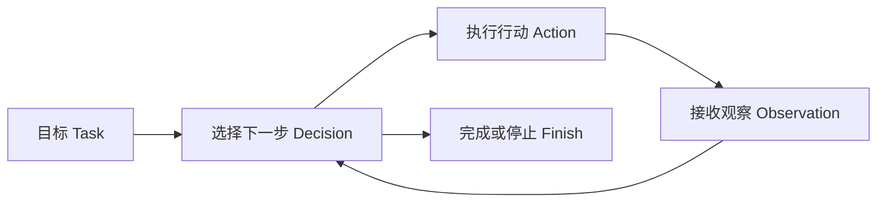

# L01 什么是 Agent：从一次回答到持续行动

> 建议学习时间：60–90 分钟。讲解约 40%，动手实践约 60%。本课完全离线，不需要 API Key。

## 1. 本节要解决的真实问题

假设同事把一个陌生代码仓库交给你，只说：“帮我判断这个项目是做什么的，入口在哪里，有没有测试。”如果只把这句话交给普通大语言模型（Large Language Model，LLM），模型并没有看到仓库内容。它最多根据常见项目结构猜测：“可能有 README、源代码和测试目录。”这句话语法通顺，却没有证据。

真正的开发者不会停在猜测上。他会先看文件列表，再读 README；如果 README 不存在，就搜索入口函数、配置文件和测试目录；拿到新信息后再决定下一步。这种“根据目标采取行动，读取环境反馈，再继续决策”的过程，才是我们要学习的 Agent（智能体）。

本课从四个问题开始：

1. 为什么能聊天、能写代码的 LLM 还不等于 Agent？
2. 程序调用了一次工具，就自动成为 Agent 了吗？
3. Agent 与提前写好的自动化流程有什么区别？
4. 判断一个系统是不是 Agent，应该看界面、模型，还是执行轨迹？

先记住本课的临时定义：**Agent 是一个围绕目标运行的闭环系统；它能够读取当前信息、选择下一步行动、接收行动结果，并据此继续决策，直到完成或明确停止。** 后面三课会逐项拆开这个定义。

## 2. 前置知识与问题链

你只需要会 Python 函数、列表、字典和 `for` 循环。我们暂时不用真实模型，而用确定性代码模拟“模型做决定”，这样每次运行结果一致，注意力可以放在 Agent 的结构上。

先沿着下面的问题链推导，而不是背结论：

```text
模型知道训练数据中的一般知识
        ↓
但它不知道当前仓库里此刻有哪些文件
        ↓
要获得事实，就必须读取外部环境
        ↓
读取哪个文件，需要先做一次选择
        ↓
工具结果可能成功、失败或出现意外内容
        ↓
下一步必须依据新结果重新选择
        ↓
因此关键不是“一次生成”，而是“决策—行动—观察”的闭环
```

这里最重要的转变是：把 LLM 从“答案生成器”看成“下一步决策器”。它仍然可能犯错，也不直接读磁盘；真正让系统产生行动能力的是模型、工具、循环和环境共同组成的运行过程。

## 3. 两个具体案例与生活类比

### 案例一：分析陌生仓库

一次性回答程序收到任务后立刻生成结论。因为没有读取文件，它只能说“这个仓库可能是 Python 项目”。Agent 则先列目录，观察到 `calculator.py` 和 `test_calculator.py`；接着读取 `README.md`，观察到“A tiny calculator project”；最后才给出有证据的结论。

两者都可能输出一句自然语言，但证据链不同。我们不能只看最后一句话判断系统类型，必须看它如何得到这句话。

### 案例二：修复失败测试

普通 LLM 可以根据你粘贴的报错建议修改代码，但它不知道修改后测试是否通过。Coding Agent 可以读取报错、定位代码、生成补丁、执行测试并观察退出码。如果测试仍失败，它不会把“补丁已生成”误当成“任务已完成”，而会根据新报错继续调整。

### 类比：闭眼问路与边走边看

一次性回答像出发前只问一次路线，然后闭着眼一直走。固定 Workflow（工作流）像导航软件预先规定“直行、左转、再直行”；Agent 更像能够看路标的驾驶者：道路正常时按计划走，发现封路后会观察现场并改选路线。Agent 并不一定比导航更高级；路线稳定时，固定导航反而更便宜、更可预测。差别在于谁决定下一步，以及决定时有没有使用最新观察。

## 4. 三种系统的执行轨迹

### Single-shot LLM：一次输入，一次输出

```text
Task ──> LLM ──> Answer
```

Single-shot（单次调用）适合解释概念、改写文本、总结已提供内容。它没有外部行动，也没有根据行动结果再次决策。

### Workflow：路径由开发者预先规定

```text
Task ──> list_files ──> read_README ──> summarize ──> Answer
```

Workflow 可以调用 LLM，也可以完全不用 LLM。关键是步骤和分支主要由开发者提前写死。它适合稳定、重复、审计要求高的任务。

### Agent：路径由运行中的观察推动



Agent 的路径不是完全没有规则。开发者仍然规定可用工具、安全边界和最大步骤；只是“当前应该调用哪个工具、参数是什么、拿到结果后做什么”可以在运行中动态决定。

## 5. 本课核心概念：闭环比聪明更重要

Agent 的最小闭环可以写成：

```text
目标 → 决策 → 行动 → 观察 → 新决策 → …… → 完成/停止
```

“观察”不是日志装饰，而是改变下一步决策的输入。例如读取 README 成功，下一步可能直接总结；读取失败，下一步应改为列目录或搜索入口。没有把结果送回决策过程，工具调用再多也只是流水线。

因此，判断 Agent 的三个实用问题是：

1. 系统是否面对一个尚未完全展开的目标，而不只是执行一个函数？
2. 系统是否能对环境采取行动并获得真实结果？
3. 后续行动是否会因为前一步结果不同而改变？

三个答案都为“是”，才接近我们课程中的 Agent。自主程度可以高也可以低：每次写文件前要求人批准，仍然可以是 Agent；安全边界并不会破坏闭环。

## 6. 错误直觉与反例纠正

### 误区一：能连续聊天的就是 Agent

聊天机器人保存历史消息，只说明它有上下文。若每轮都只是“用户提问—模型回答”，没有行动和环境反馈，它仍是多轮对话系统。记忆不是行动，长对话也不自动形成闭环。

### 误区二：调用过一次工具的就是 Agent

程序固定先查天气再让模型润色，路径没有根据结果变化，它更像 Workflow。真正的问题不是“有没有 Tool”，而是 Tool 的 Observation 是否进入下一轮决策。

### 误区三：大量 `if/else` 就是 Agent

`if 文件存在就读取，否则报错` 可以很实用，但分支完全由开发者提前穷举，仍属于 Workflow。Agent 允许决策器在约束范围内依据语义和观察选择路径。反过来，Agent 内部也一定会有 `if/else` 处理协议、安全和错误；不能凭某一行语法分类。

### 误区四：Agent 必须完全自治

生产级 Coding Agent 常在危险命令、写文件、提交代码前暂停审批。Human-in-the-loop（人在回路中）是安全设计，不是“不够 Agent”。目标是可控地完成任务，不是追求无人监管的表演。

## 7. 完整手工运行轨迹

下面这条轨迹来自本课脚本中的内存仓库，不访问真实磁盘：

```text
Task: Explain this unfamiliar repository
Single-shot: This repository probably contains Python source and tests.
Agent trace:
  Decision: inspect the file list
  Observation: files = ['README.md', 'calculator.py', 'test_calculator.py']
  Decision: read README.md
  Observation: A tiny calculator project.
  Finish: this is a calculator project with one source file and one test file.
```

注意两点。第一，Single-shot 的回答并非一定错误，但“probably”暴露了它没有证据。第二，Agent 的价值不在于输出更长，而在于结论能回溯到两次观察。如果 `README.md` 不存在，理想 Agent 应根据失败重新选择；这个能力会在 L04 完成。

## 8. 完整离线代码

完整代码位于 [l01_single_shot_vs_agent.py](../../../agent-from-scratch/course-checkpoints/01-agent-concepts/steps/l01_single_shot_vs_agent.py)。为便于逐行学习，这里完整展示：

```python
REPOSITORY = {
    "README.md": "A tiny calculator project.",
    "calculator.py": "def add(a, b): return a + b",
    "test_calculator.py": "def test_add(): assert add(1, 2) == 3",
}


def single_shot_answer(task: str) -> str:
    del task
    return "This repository probably contains Python source and tests."


def run_small_agent(task: str) -> list[str]:
    del task
    trace = ["Decision: inspect the file list"]
    files = sorted(REPOSITORY)
    trace.append(f"Observation: files = {files}")
    trace.append("Decision: read README.md")
    trace.append(f"Observation: {REPOSITORY['README.md']}")
    trace.append("Finish: this is a calculator project with one source file and one test file.")
    return trace


if __name__ == "__main__":
    task = "Explain this unfamiliar repository"
    print(f"Task: {task}")
    print(f"Single-shot: {single_shot_answer(task)}")
    print("Agent trace:")
    for line in run_small_agent(task):
        print(f"  {line}")
```

这段代码还不是最终 Agent：`run_small_agent` 把两步行动写死了，没有真正的动态决策器。我们故意保留这个“不完整”，因为学习顺序应是先看见轨迹，再在 L02 引入 `ScriptedLLM`、工具注册表和循环，而不是第一课就抄最终架构。

## 9. 关键代码逐段解释

`REPOSITORY` 模拟 Environment（环境）。真实 Coding Agent 的环境是工作区、文件系统、Git 状态和命令进程；这里用字典代替，是为了离线、确定且安全。

`single_shot_answer` 故意不读取 `REPOSITORY`。它代表“模型只看到了任务文本”。函数参数被删除，是在提醒我们：流畅答案并不等于使用了事实。

`run_small_agent` 产生 Trace（轨迹）。轨迹记录 Decision 和 Observation，使我们能够审计“为什么得出结论”。但决策顺序仍由 Python 作者预先写死，所以它只是 Agent 轨迹的演示模型，还不能根据 README 缺失改变路线。

最后的 `for` 循环只是展示轨迹，不是 Agent Loop。真正的 Loop 必须把 Observation 重新交给决策器。区分“打印循环”和“决策闭环”非常重要。

## 10. 运行验证与故障实验

在仓库根目录运行：

```powershell
python agent-from-scratch/course-checkpoints/01-agent-concepts/steps/l01_single_shot_vs_agent.py
```

预期输出应与第 7 节一致。然后做两个故障实验：

1. 删除 `REPOSITORY` 中的 `README.md` 后运行。你会得到 `KeyError`，说明固定轨迹无法应对环境变化。
2. 把 README 内容改成“A web API”，再次运行。Agent 轨迹中的观察会变化，但最后一句仍写死为 calculator，说明“有观察但不使用观察”同样不够。

这两个失败非常有价值：它们把下一课的需求推导出来了。我们需要一个接收观察、再产生下一步决定的对象；模块 1 使用完全离线的 `ScriptedLLM` 来承担这个角色。

## 11. 基础实验与进阶挑战

### 基础实验

修改脚本，让最终结论根据 `README.md` 的真实内容生成，而不是写死。要求保留完整轨迹，并验证修改 README 后输出同步变化。

### 基础实验二

新增 `pyproject.toml`，让轨迹先列目录，再说明“发现 Python 打包配置”。不要直接改最终答案，必须让这条事实先作为 Observation 出现。

### 进阶挑战

设计一个 `choose_next_action(observations)` 函数：第一次选择列文件；看到 README 后选择读取；读取成功后选择完成；读取失败后选择查看 Python 文件。暂时不要求工具注册表，重点是让下一步真正依赖观察历史。

练习完成后再查看 [模块练习参考答案](模块练习参考答案.md)，先独立写出你的版本。

## 12. 自测、总结与下一课

1. 为什么一个能回答编程问题的 LLM 还不能自动分析本地仓库？
2. “固定查天气再总结”的程序为什么更接近 Workflow，而不是 Agent？
3. 在 Agent 闭环中，Observation 为什么必须进入下一轮 Decision？
4. 人工审批写文件会让系统失去 Agent 属性吗？为什么？
5. 只看最终自然语言答案，为什么无法判断背后是不是 Agent？

本课建立了第一个心智模型：**Agent 的身份来自运行闭环，不来自聊天界面、模型名称或“智能”宣传。** 我们也主动暴露了当前代码的缺陷：行动路径写死、观察没有真正改变决策。下一课 [L02 Agent 四要素](L02-Agent四要素.md) 会把这个演示升级为包含 `LLM + Tool + Loop + Environment` 的最小可运行系统。
