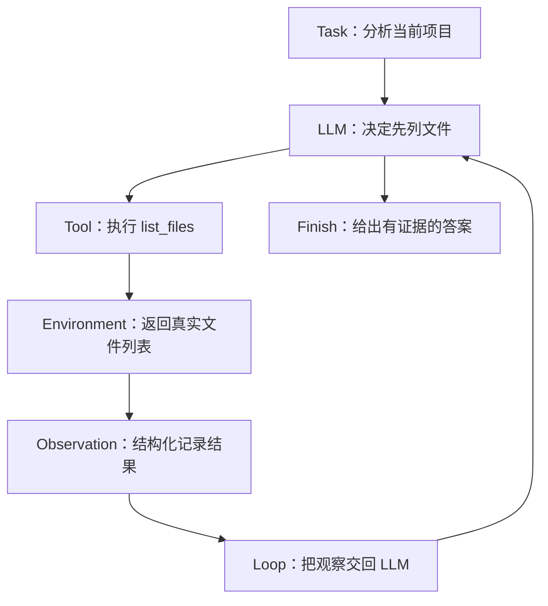

# L02 Agent 四要素：LLM、Tool、Loop、Environment

> 建议学习时间：60–90 分钟。讲解约 40%，动手实践约 60%。本课使用 `ScriptedLLM`，完全离线运行。

## 1. 本节要解决的真实问题

L01 的程序已经能打印“决策—观察—完成”轨迹，但它有两个明显问题：行动顺序写死在函数里，最终答案也没有真正使用观察。要让程序面对仓库变化时选择不同路径，究竟需要哪些部件？每个部件应该负责什么，又不应该负责什么？

本课把最小 Agent 拆成四个要素：

```text
Agent = LLM + Tool + Loop + Environment
```

这不是数学等式，也不是唯一的行业定义，而是一张适合初学者检查系统完整性的地图。四个要素分别回答四个问题：谁选择下一步？靠什么产生外部作用？谁让过程持续？行动发生在哪里？

本课要避免“把所有逻辑都塞进模型提示词”的常见错误。一个可靠 Agent 不是一个神奇 Prompt，而是一组职责清楚、数据能够流动的部件。

## 2. 前置知识回顾与问题链

上一课得到三个结论：Agent 面向目标运行；工具结果要进入下一轮决策；执行轨迹比最终文案更能说明系统类型。现在继续追问：

1. 如果只有 LLM，它能读取当前磁盘吗？
2. 如果只有 Tool，谁来根据任务选择工具？
3. 如果 LLM 选择了一次工具，谁把结果送回去并继续运行？
4. 如果工具能读取任意路径，系统是否知道允许操作哪个仓库？

推导结果如下：



注意箭头比方框更重要。四个对象即使都存在，但数据没有从 Environment 经 Observation 回到 LLM，系统仍然没有闭环。

## 3. 一致类比：开发者、工具箱、工作节奏和仓库

把 Coding Agent 想成一位刚接手项目的开发者：

| Agent 要素 | 开发场景类比 | 主要职责 | 不应承担的职责 |
| --- | --- | --- | --- |
| LLM | 开发者的大脑 | 理解目标，根据现有信息选择下一步 | 伪造工具结果、绕过权限、直接操作磁盘 |
| Tool | 工具箱中的命令 | 读取文件、搜索文本、运行测试等明确动作 | 自己猜任务意图、无限扩大操作范围 |
| Loop | 工作节奏 | 让“决定—执行—观察”持续，并判断停止 | 替模型编造结论、吞掉错误后假装成功 |
| Environment | 当前代码仓库和进程 | 提供真实状态，承受行动产生的影响 | 保证模型决策一定正确 |

这个类比的价值在于边界清楚。开发者可以决定“运行测试”，但真正执行的是测试命令；命令退出码来自操作系统，不由开发者想象；看到失败后，开发者才调整下一步。若“大脑”可以直接声称测试通过，整个系统就失去了可信度。

## 4. 四要素逐个推导

### LLM：受上下文约束的决策器

LLM（本模块用 `ScriptedLLM` 模拟）接收任务与已有观察，输出一个 Decision。Decision 可能是“调用某工具”，也可能是“信息足够，结束”。它负责语义判断，但它只能看到传入的上下文，不能天然知道当前仓库、时间或命令结果。

本模块的 `ScriptedLLM` 不是真的模型。它按顺序返回预设字典，让执行可重复。真实模型与脚本模型虽然智能程度不同，但在 Agent Loop 中扮演相同接口角色：`decide(task, observations)`。

### Tool：受约束的能力接口

Tool（工具）是 Python 函数及其可调用约定。例如 `read_file(path)`、`list_files()`。工具把外部能力包装成明确输入和输出。工具应该校验参数、暴露失败，而不是把异常伪装成空字符串。

工具越强，风险越高。`list_files` 只读且范围有限；`run_command` 可能执行任意进程。后续模块会加入工作区边界、审批和超时。本课只用内存仓库，先理解结构。

### Loop：让观察真正改变后续行为

Loop（循环）维护 Observation 列表，每轮把完整观察交给决策器，执行决定，再把结果追加回列表。它还必须有限制，例如 `max_steps`。没有停止条件的 Agent 不是更自主，而是可能无限消耗资源的程序。

### Environment：事实与副作用所在之处

Environment（环境）是 Agent 可以感知和影响的外部世界。Coding Agent 的环境通常包含工作区文件、Git 仓库、命令进程、测试结果和权限策略。本课用 `REPOSITORY` 字典模拟环境，让工具读取真实字典内容，而不是直接打印预设观察。

环境与 Context（上下文）不是同一个概念。环境可能有一万个文件，但上下文只包含工具刚返回的十个文件名。Agent 对环境的认识永远是局部的，这正是它需要持续行动的原因。

## 5. 缺少任一要素会退化成什么

### 缺少 LLM：只剩固定自动化

工具和循环仍可工作，但下一步只能由开发者写死。它可能是优秀 Workflow，却无法依据未预见的语义动态选路。

### 缺少 Tool：只剩语言推测

LLM 可以规划“我应该读取 README”，但没有执行接口。系统会把行动意图写成文字，却无法获得真实 Observation。这是许多“假 Agent 演示”的问题。

### 缺少 Loop：只完成半步

LLM 选择 `list_files`，工具也返回结果，但程序立即退出。观察没有回传，模型无法基于列表继续读取 README。一次 Tool Calling 不是完整 Agent Loop。

### 缺少 Environment：工具没有事实来源

如果 `read_file` 总是返回写死的“示例内容”，无论路径和仓库如何变化，系统只是在表演轨迹。测试替身可以模拟环境，但它仍必须对不同输入给出一致、可解释的状态变化。

## 6. 两个案例与两个错误直觉

### 案例一：README 存在

决策器先调用 `list_files`，观察到 `README.md`；下一轮调用 `read_file`；拿到“A command-line todo application”后完成。这里两次 Tool 调用由 Loop 串起来，结论来自 Environment。

### 案例二：README 不存在

如果工具直接抛出 `KeyError` 而 Loop 不处理，整个 Agent 崩溃。如果 Loop 把失败转换成 Observation，决策器可以改为搜索 `main.py`。L02 的简化代码还没有恢复机制，故障会暴露出来；L04 会补齐它。

### 误区一：LLM 是 Agent 的全部

模型再强，也不能替代权限检查、工具执行、重试上限和环境事实。把这些责任写进 Prompt 只是“请求模型遵守”，不是程序级保证。

### 误区二：工具越多，Agent 越强

工具过多会增加选择歧义和攻击面。一个任务只需要读取、搜索和测试时，暴露数据库删除或系统关机工具不会提高能力，只会降低可控性。工具集合应该围绕目标最小化。

### 误区三：Loop 就是普通 `for` 循环

语法上我们确实使用 `for`，但闭环成立的条件是：本轮 Observation 成为下轮 Decision 的输入。一个只负责重复打印的循环不具备这种数据反馈。

## 7. 完整运行轨迹

运行本课代码后会看到：

```text
LLM + Tool + Loop + Environment
Step 1 decision: {'type': 'tool', 'name': 'list_files', 'arguments': {}}
Step 1 observation: {'tool': 'list_files', 'output': ['README.md', 'todo.py']}
Step 2 decision: {'type': 'tool', 'name': 'read_file', 'arguments': {'path': 'README.md'}}
Step 2 observation: {'tool': 'read_file', 'output': 'A command-line todo application.'}
Step 3 decision: {'type': 'finish', 'answer': 'This is a command-line todo application.'}
Finish: This is a command-line todo application.
```

第一轮调用 `decide` 时观察列表为空；第二轮观察列表已有文件清单；第三轮已有两个观察。当前脚本为了简短按轮次返回决定，但接口已经把 `observations` 传入。L04 会展示失败观察如何实质改变后续选择。

## 8. 完整离线代码

源码位于 [l02_four_elements.py](../../../agent-from-scratch/course-checkpoints/01-agent-concepts/steps/l02_four_elements.py)。

```python
from collections.abc import Callable
from typing import Any

REPOSITORY = {
    "README.md": "A command-line todo application.",
    "todo.py": "def add_todo(title): ...",
}

def list_files() -> list[str]:
    return sorted(REPOSITORY)

def read_file(path: str) -> str:
    return REPOSITORY[path]

TOOLS: dict[str, Callable[..., Any]] = {
    "list_files": list_files,
    "read_file": read_file,
}

class ScriptedLLM:
    def __init__(self) -> None:
        self.round = 0

    def decide(self, task: str, observations: list[dict[str, Any]]) -> dict[str, Any]:
        del task, observations
        decisions = [
            {"type": "tool", "name": "list_files", "arguments": {}},
            {"type": "tool", "name": "read_file", "arguments": {"path": "README.md"}},
            {"type": "finish", "answer": "This is a command-line todo application."},
        ]
        decision = decisions[self.round]
        self.round += 1
        return decision

def run_agent(task: str, llm: ScriptedLLM, max_steps: int = 5) -> list[dict[str, Any]]:
    observations: list[dict[str, Any]] = []
    for step in range(1, max_steps + 1):
        decision = llm.decide(task, observations)
        print(f"Step {step} decision: {decision}")
        if decision["type"] == "finish":
            print(f"Finish: {decision['answer']}")
            return observations

        tool = TOOLS[decision["name"]]
        output = tool(**decision["arguments"])
        observation = {"tool": decision["name"], "output": output}
        observations.append(observation)
        print(f"Step {step} observation: {observation}")
    return observations

if __name__ == "__main__":
    print("LLM + Tool + Loop + Environment")
    run_agent("Explain this repository", ScriptedLLM())
```

## 9. 关键代码逐段解释

`REPOSITORY` 是环境状态；`list_files` 和 `read_file` 是环境的受控入口。决策器不能直接访问字典，这个限制模拟真实系统中“模型不能直接碰磁盘”。

`TOOLS` 是 Tool Registry（工具注册表）。Decision 只传工具名，运行程序再从注册表找到函数。这样新增工具不必在循环里不断增加 `elif tool_name == ...`。注册表本身不决定使用哪个工具，只负责名字到能力的映射。

`ScriptedLLM.decide(task, observations)` 建立教学接口。它现在按 `round` 返回预设决定，所以不智能，但测试稳定。后续替换真实 LLM 时，Loop 无需知道模型内部如何生成决定。

`run_agent` 的本质是数据搬运：任务与观察进入决策器，Decision 进入工具，工具输出变成 Observation，再进入下一轮。`max_steps` 已出现在函数签名中，但当前代码循环耗尽后只返回观察，没有明确原因；L04 会把停止语义补全。

## 10. 运行命令与四个故障实验

```powershell
python agent-from-scratch/course-checkpoints/01-agent-concepts/steps/l02_four_elements.py
```

请分别做以下实验，每次只破坏一个要素并记录现象：

1. 删除 `ScriptedLLM` 的第二个决定。结果会在下一轮下标越界，说明决策器无法继续供给 Decision。
2. 从 `TOOLS` 删除 `read_file`。程序产生 `KeyError`，说明行动名字没有对应能力。
3. 在追加 Observation 后立即 `return`。程序只能列文件，无法根据结果继续。
4. 删除 `REPOSITORY["README.md"]`。读取工具失败，暴露当前 Loop 没有把错误转换成可学习的观察。

故障实验不是为了把程序弄坏，而是验证四要素各自承担了不可替代的责任。请不要同时修改两处，否则无法判断根因。

## 11. 基础练习与进阶挑战

### 基础练习一

新增 `count_python_files()` 工具，并在 `TOOLS` 注册。让 `ScriptedLLM` 在读取 README 后调用它，再完成回答。要求观察列表中出现三个有顺序的结果。

### 基础练习二

在 `run_agent` 每轮调用 `decide` 前打印当前 Observation 数量，验证它依次为 0、1、2，而不是每轮重新创建空列表。

### 进阶挑战

让 `ScriptedLLM.decide` 不再只看 `round`：当最新 Observation 表示 README 缺失时选择 `list_files`；当读取成功时选择 `finish`。你可以暂时用字典判断，不需要真实模型。

参考思路与测试方式放在 [模块练习参考答案](模块练习参考答案.md)，完成自己的尝试后再查看。

## 12. 自测、总结与下一课

1. LLM 为什么只能决定调用工具，而不应直接伪造工具输出？
2. Tool Registry 解决了什么问题，又没有解决什么问题？
3. Environment 与模型 Context 有什么区别？
4. 一个循环执行了十次工具，但每次都不给模型看结果，为什么仍不是有效闭环？
5. 删除四要素中的 Tool 后，系统会具体退化成什么？

本课完成了第一个真正包含 `ScriptedLLM`、`TOOLS`、Observation 列表和 Loop 的离线程序。四要素不是四个时髦名词，而是四种不能混淆的职责。下一课 [L03 Agent 与 Workflow](L03-Agent与Workflow.md) 会用同一个仓库任务实现两套完整方案，回答更重要的问题：既然 Workflow 更简单，什么时候才值得让模型动态决策？
