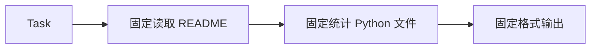
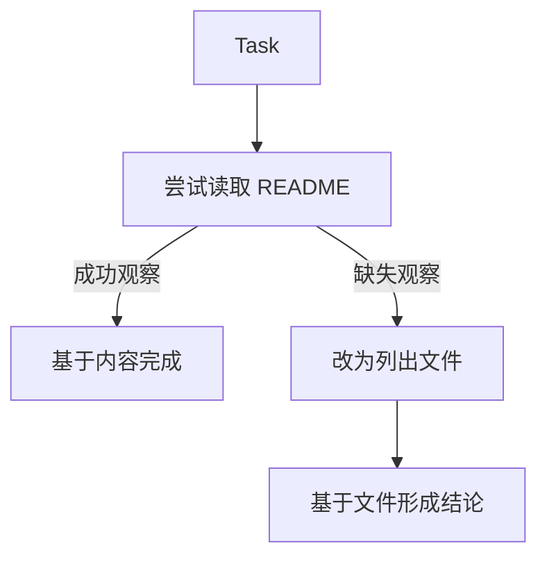

# L03 Agent 与 Workflow：什么时候不该使用 Agent

> 建议学习时间：60–90 分钟。讲解约 40%，动手实践约 60%。本课用同一任务实现 Workflow 与 Agent 两个版本。

## 1. 本节要解决的真实问题

学完四要素后，很容易产生一种兴奋：“既然 Agent 能动态决策，那所有自动化都改成 Agent 不就更强了吗？”这是危险的工程直觉。动态决策带来适应性，也带来输出不确定、调用次数增加、审计复杂和安全面扩大。

本课只解决一个选型问题：**一项任务应该由开发者预先规定路径，还是允许模型在运行中选择路径？**

我们使用完全相同的目标：“判断仓库用途并报告文件情况。”先实现固定 Workflow，再实现能够根据 Observation 改变路径的 Agent。随后让 `README.md` 分别存在和缺失，观察两套系统如何表现。

课程不是要选出永久赢家，而是训练你根据任务特征做取舍。很多生产系统的最佳方案是混合结构：外层 Workflow 控制关键阶段，局部 Agent 处理路径不确定的分析任务。

## 2. 前置知识回顾与问题链

L02 中的 `LLM + Tool + Loop + Environment` 说明了 Agent 如何成立，但“能做”不等于“应该做”。继续追问：

1. 如果每个仓库都保证有 README，是否需要模型决定先读什么？
2. 如果仓库结构不可预测，开发者能否提前枚举所有分支？
3. 如果任务涉及付款、删除数据或发布生产，动态选择是否值得风险？
4. 如果同一输入必须每次产生相同步骤，Agent 的概率性是否成为负担？
5. 如果只在异常情况下需要探索，能否先 Workflow、失败后再进入 Agent？

核心分界不是“有没有 LLM”，而是 **control flow ownership（控制流所有权）**：

```text
Workflow：开发者在运行前决定主要步骤与分支
Agent：决策器在运行中根据目标和观察选择下一步
```

一个 Workflow 完全可以在“总结”步骤调用 LLM；一个 Agent 也一定包含开发者写好的协议分支。分类关注谁拥有业务路径的主要决定权，而不是搜索某个函数名。

## 3. 同一任务的两种思路

### Workflow 思路

开发者假设仓库总有 README，固定执行：读取 README → 统计 Python 文件 → 拼接答案。路径短、输出稳定、容易测试。



### Agent 思路

决策器先尝试 README；若成功则根据内容完成；若失败则列目录，再根据目录形成替代结论。



Agent 不是“先写一个万能规划”。它只是把原先由开发者预先固定的某些路径选择，延迟到拿到真实观察之后。

## 4. 案例一：README 存在时

仓库内容为：

```python
with_readme = {
    "README.md": "A weather CLI.",
    "weather.py": "...",
}
```

Workflow 一次读取成功，直接输出用途和 Python 文件数。Agent 也先读取 README，再完成。两者都正确，但 Agent 多维护了 Decision、Observation 和 Loop；若接入真实模型，还会增加延迟与费用。

在结构稳定的正常路径中，Workflow 明显更合适。用 Agent 重写不会凭空提高答案质量，只会把确定路径变成可能波动的路径。这就是第一个重要结论：**当任务可完全描述、分支少且稳定时，优先 Workflow。**

## 5. 案例二：README 缺失时

第二个仓库只有：

```python
without_readme = {
    "main.py": "...",
    "tests.py": "...",
}
```

Workflow 执行 `repository["README.md"]` 时抛出 `KeyError`。这不是 Workflow 天生不能处理缺失，而是开发者没有预先设计该分支。我们当然可以增加 `if README exists`，再增加 `pyproject.toml`、`package.json`、`Cargo.toml` 等分支；只要变化有限，这仍然是好方案。

Agent 收到“missing”观察后改为列文件，最终回答“No README. Files: main.py, tests.py”。它展示的是对未固定路径的适应性。如果陌生仓库类型很多、目标开放且下一步高度依赖内容语义，逐项穷举的维护成本会快速上升，这时 Agent 开始有价值。

第二个结论是：**Agent 适合路径不确定，不代表它自动处理所有异常。** 未知工具、权限拒绝、无限循环仍要由程序边界控制，不能只靠模型临场发挥。

## 6. 五维选型表与混合方案

| 维度 | 更适合 Workflow | 更适合 Agent |
| --- | --- | --- |
| 可预测性 | 输入结构稳定，步骤可以提前列全 | 环境差异大，下一步依赖新观察 |
| 成本与延迟 | 高频批处理、低延迟、调用预算严格 | 低频高价值任务，允许多轮探索 |
| 审计 | 要求每次经过相同审批节点 | 允许不同路径，但必须保留完整 Trace |
| 安全 | 付款、删除、发布等高风险操作 | 只读分析或每个高风险动作均需批准 |
| 任务不确定性 | 目标和验收规则明确 | 目标明确但实现路径无法预先穷举 |

不要简单数哪一列更多。安全和合规可能是“一票否决”条件。例如生产发布即使路径复杂，也应把构建、审批、部署、回滚写成 Workflow；可以让 Agent 在其中分析失败日志，但不能让模型随意跳过审批。

常见混合设计是：

```text
Workflow：接收工单 → 创建隔离工作区 → [Agent 分析与修改] → 固定测试门禁 → 人工审批 → 提交
```

这样既保留探索能力，又让边界、验收和副作用由确定代码控制。

## 7. 错误直觉与反例纠正

### 误区一：Agent 一定比 Workflow 高级

“高级”不是工程指标。一个三步确定任务使用 Agent，通常更贵、更慢、更难复现。Cron 定时备份、数据库迁移、支付扣款不因加入模型而升级。最简单且满足需求的系统，才是更好的系统。

### 误区二：使用 LLM 就是 Agent

固定执行“读取文本 → LLM 摘要 → 保存结果”仍是 Workflow，因为模型只完成某一步内容转换，没有选择整体路径。反之，本课用确定性的 `RepositoryAgent` 模拟动态选择，没有真实 API，仍能演示 Agent 控制流。

### 误区三：有 `if/else` 就不是 Agent

Agent Loop 必须用确定代码处理协议，例如 `if decision.type == "finish"`。区别不在是否存在分支，而在业务层下一步是否可以根据语义观察动态决定。安全边界越明确，Agent 越可靠。

### 误区四：Agent 可以省掉需求定义

目标含糊时，Agent 只会更自由地偏离。即使路径动态，任务、工具权限、停止条件和验收标准仍应明确。Agent 解决“怎么走不确定”，不解决“我们根本不知道要去哪”。

## 8. 两份完整可运行实现

源码位于 [l03_workflow_vs_agent.py](../../../agent-from-scratch/course-checkpoints/01-agent-concepts/steps/l03_workflow_vs_agent.py)。L02 的 `ScriptedLLM` 按轮次给决定；本课的 `RepositoryAgent` 开始根据 Observation 内容分支。

```python
from typing import Any

def workflow(repository: dict[str, str]) -> str:
    """The developer fixes the path before execution starts."""
    readme = repository["README.md"]
    source_count = sum(name.endswith(".py") for name in repository)
    return f"{readme} Python files: {source_count}."

class RepositoryAgent:
    def decide(self, observations: list[dict[str, Any]]) -> dict[str, Any]:
        if not observations:
            return {"type": "read", "path": "README.md"}
        if observations[-1]["status"] == "missing":
            return {"type": "list"}
        if observations[-1]["action"] == "read":
            return {"type": "finish", "answer": observations[-1]["content"]}
        files = observations[-1]["files"]
        return {"type": "finish", "answer": f"No README. Files: {', '.join(files)}"}

def agent(repository: dict[str, str]) -> str:
    observations: list[dict[str, Any]] = []
    brain = RepositoryAgent()
    while True:
        decision = brain.decide(observations)
        print(f"  decision: {decision}")
        if decision["type"] == "finish":
            return decision["answer"]
        if decision["type"] == "read":
            path = decision["path"]
            if path in repository:
                observation = {
                    "action": "read", "status": "success",
                    "content": repository[path],
                }
            else:
                observation = {"action": "read", "status": "missing", "path": path}
        else:
            observation = {
                "action": "list", "status": "success",
                "files": sorted(repository),
            }
        observations.append(observation)
        print(f"  observation: {observation}")

if __name__ == "__main__":
    with_readme = {"README.md": "A weather CLI.", "weather.py": "..."}
    without_readme = {"main.py": "...", "tests.py": "..."}

    print("Workflow with README:", workflow(with_readme))
    try:
        print("Workflow without README:", workflow(without_readme))
    except KeyError as error:
        print(f"Workflow without README failed: {error}")

    print("Agent with README:")
    print(" ", agent(with_readme))
    print("Agent without README:")
    print(" ", agent(without_readme))
```

## 9. 代码对照与运行轨迹

`workflow` 没有观察列表，也不需要 `while`。它的契约清楚：仓库必须有 README。只要前置条件成立，这是优势，不是缺陷。

`RepositoryAgent.decide` 只读取观察，不直接读仓库。`agent` 函数负责执行动作并产生观察。这个分离让我们能清楚指出：决策器负责选路，环境操作由程序执行。

运行后关键输出如下：

```text
Workflow with README: A weather CLI. Python files: 1.
Workflow without README failed: 'README.md'
Agent with README:
  decision: {'type': 'read', 'path': 'README.md'}
  observation: {'action': 'read', 'status': 'success', 'content': 'A weather CLI.'}
  decision: {'type': 'finish', 'answer': 'A weather CLI.'}
   A weather CLI.
Agent without README:
  decision: {'type': 'read', 'path': 'README.md'}
  observation: {'action': 'read', 'status': 'missing', 'path': 'README.md'}
  decision: {'type': 'list'}
  observation: {'action': 'list', 'status': 'success', 'files': ['main.py', 'tests.py']}
  decision: {'type': 'finish', 'answer': 'No README. Files: main.py, tests.py'}
   No README. Files: main.py, tests.py
```

最值得观察的是第二个 Agent 场景：相同任务因为第一次 Observation 不同，执行轨迹从两轮变成三轮。这是动态控制流的证据。

## 10. 运行命令与对照测试

```powershell
python agent-from-scratch/course-checkpoints/01-agent-concepts/steps/l03_workflow_vs_agent.py
```

你还可以写一个最小对照测试：

```python
def test_workflow_and_agent_make_different_tradeoffs():
    stable_repo = {"README.md": "A CLI.", "main.py": "..."}
    unusual_repo = {"main.py": "..."}

    assert workflow(stable_repo) == "A CLI. Python files: 1."
    assert agent(stable_repo) == "A CLI."

    try:
        workflow(unusual_repo)
        assert False, "workflow should expose its unmet precondition"
    except KeyError:
        pass
    assert agent(unusual_repo) == "No README. Files: main.py"
```

故障实验：让 `RepositoryAgent` 在缺少 README 时反复返回 `{"type": "list"}`。当前 `while True` 会无限运行，说明动态路径必须配套 `max_steps`。这个缺陷将在 L04 修复。

## 11. 基础练习与进阶挑战

### 基础练习一

给 Workflow 增加 README 缺失分支，然后重新比较。思考：当只有两个稳定分支时，Agent 还有明显优势吗？把结论写在代码注释旁。

### 基础练习二

新增第三种仓库：只有 `package.json` 和 `src/index.js`。分别扩展 Workflow 与 Agent，并记录两者增加了多少业务分支。

### 进阶挑战

实现混合方案：先用 Workflow 尝试 README；只有缺失时才调用 Agent 探索。记录两种仓库下的决策次数，并解释这种设计如何控制成本。

完成后可核对 [模块练习参考答案](模块练习参考答案.md)，答案重点是取舍理由，不是唯一代码写法。

## 12. 自测、总结与下一课

1. 一个固定调用 LLM 做摘要的程序为什么仍可能是 Workflow？
2. 在 README 始终存在的场景中，Agent 相比 Workflow 增加了哪些成本？
3. “任务不确定”与“目标含糊”有什么区别？
4. 哪些高风险环节应该固定在 Workflow 中，而不是交给模型决定？
5. 如何从执行轨迹判断控制流主要属于开发者还是 Agent？

本课没有宣布 Agent 获胜，而是建立了工程判断：稳定路径优先 Workflow，开放路径才考虑 Agent，高风险边界继续由确定代码控制。下一课 [L04 手工走一遍 Think–Act–Observe](L04-手工走一遍Think-Act-Observe.md) 将完善模块最终单文件 Agent，重点处理失败观察、未知工具、`max_steps` 和明确的 `finish_reason`。
