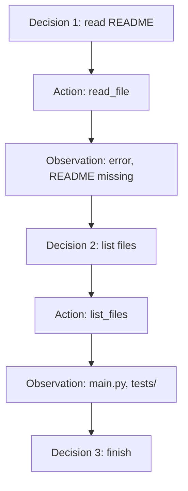

# L04 手工走完 Think–Act–Observe：让失败成为下一步信息

> 建议学习时间：60–90 分钟。讲解约 40%，动手实践约 60%。本课完成模块 1 最终离线 Agent。

## 1. 本节要解决的真实问题

前三课已经出现 Decision、Tool 和 Loop，但仍有一个关键缺口：工具失败时，程序是崩溃，还是让 Agent 看见失败并调整行动？如果 Agent 一直选择同一个无效动作，谁负责停止？如果模型请求一个根本不存在的工具，最终结果如何向调用者解释？

本课围绕 Observe（观察）展开。我们要完成一个至少两轮决策的 Coding Agent：它先尝试读取 `README.md`；读取失败后，不是假装成功，也不是立即崩溃，而是收到结构化错误观察；下一轮改为列出文件；看到 `main.py` 后给出结论。

最终程序还必须回答“为什么结束”：

```text
completed      正常完成并产生答案
unknown_tool   决策器请求了未注册工具
max_steps      达到最大步骤仍未完成
decision_error 决策器本身无法继续
```

这些只是模块 1 的教学字符串，不是模块 4 的正式 Runtime 协议。我们先理解语义，再逐步工程化。

## 2. 前置知识回顾与问题链

L01 说明 Agent 的身份来自闭环；L02 拆出 `LLM + Tool + Loop + Environment`；L03 说明动态控制流只应在路径不确定时使用。现在沿着一次工具失败继续追问：

1. `read_file("README.md")` 抛出 `FileNotFoundError`，这是谁的事实？
2. 如果 Loop 吞掉异常并返回空字符串，决策器能区分“空文件”和“读取失败”吗？
3. 如果 Loop 直接抛异常退出，决策器还有机会选择 `list_files` 吗？
4. 如果把异常转换成 Observation，下一轮决策需要看到本轮还是全部历史？
5. 如果永远没有 Finish，Agent 如何避免无限循环？

答案逐步指向一个运行原则：**工具成功和工具失败都应产生明确 Observation；Loop 保存观察历史并交回决策器；协议或安全边界无法继续时，返回明确停止原因。**

## 3. Think、Act、Observe 到底分别是什么

### Think：选择下一步，不等于展示内心独白

课程中的 Think 表示决策阶段：根据 Task 与 Observations 输出结构化 Decision。我们不要求模型输出冗长“思维过程”，只需要可执行决定，例如：

```python
{"type": "tool", "name": "read_file", "arguments": {"path": "README.md"}}
```

结构化决定比自然语言“我打算看看 README”更可靠，因为 Loop 可以验证类型、查找工具并传递参数。

### Act：执行受控能力

Act 是程序从 `TOOLS` 注册表找到函数并调用。模型提出行动，宿主程序决定该名字是否存在、参数是否有效、是否允许执行。生产系统还会检查工作区、审批和超时。

### Observe：把环境结果变成下一轮输入

Observe 是标准化行动结果。成功时包含输出；失败时包含状态与错误信息。关键不是打印，而是追加到 `observations`，下一次 `llm.decide(task, observations)` 能看到它。



若删除 `O1 → D2` 这条箭头，系统就不再是有效闭环。

## 4. 手工追踪三轮决策

任务是：“即使 README 缺失，也要找到项目入口。”环境包含 `main.py` 和 `tests/test_main.py`，没有 README。

### 第 1 轮：合理尝试失败

Decision 请求 `read_file(path="README.md")`。Tool Registry 找到函数，函数发现路径不存在并抛 `FileNotFoundError`。Loop 捕获错误，生成：

```python
{
    "status": "error",
    "tool": "read_file",
    "error": "README.md",
}
```

失败不是最终答案，也不是被忽略的技术细节。它排除了“从 README 获取入口”这条路径。

### 第 2 轮：观察改变行动

`ScriptedLLM` 第二次被调用时，`observations` 已含失败记录。教学脚本预设它改为调用 `list_files`。工具成功返回 `['main.py', 'tests/test_main.py']`，形成第二条 Observation。

真实 LLM 未来会根据错误语义生成这个决定；模块 1 使用预设序列，是为了让我们只研究 Loop，而不让网络、模型随机性和 API 格式分散注意力。

### 第 3 轮：证据足够后完成

决策器返回 `{"type": "finish", "answer": "main.py is the likely entry point."}`。Loop 不再调用工具，而是返回 `answer`、完整 `trace` 和 `finish_reason="completed"`。

“Finish”必须是明确决定。不能因为本轮没有工具调用就猜测模型完成了，也不能把达到 `max_steps` 伪装成正常答案。

## 5. 四种状态：成功、失败、改变与完成

### 工具成功

`status="success"` 表示函数正常返回，不代表任务完成。列出文件成功只是获得证据，仍需下一轮判断。

### 工具失败

`status="error"` 表示已找到工具，但执行时出现异常。它通常可恢复，因此加入观察后继续循环。失败内容应保持清楚，不能只返回 `None`。

### 观察改变下一步

这是闭环成立的核心证据。同样的任务，在 README 存在时可直接完成；缺失时则列目录。Decision 不只依赖原始 Task，还依赖 Observation 历史。

### 最终完成

`type="finish"` 表示决策器认为信息足够。Loop 记录 Finish 并返回结果。完成不等于事实一定正确；它只表示运行按照协议正常结束。评估答案质量是后续测试与评测模块的职责。

## 6. 不可恢复边界：未知工具与最大步骤

工具执行异常可以成为观察并继续，但未知工具在本课直接停止。原因是模型请求的能力根本不存在；若盲目继续，`ScriptedLLM` 可能不断重复同一错误。结果返回：

```python
{
    "answer": None,
    "trace": [...],
    "finish_reason": "unknown_tool",
}
```

`max_steps` 是另一个硬边界。Loop 使用 `for step in range(1, max_steps + 1)`，即使模型持续调用成功工具，也最多执行指定轮数。耗尽后返回 `finish_reason="max_steps"`，不能伪造答案。

边界体现职责分工：模型决定“想做什么”，程序决定“允许做到什么程度”。提示模型“请不要无限循环”不是资源控制；`max_steps` 才是可验证的程序约束。

## 7. 完整运行轨迹

本课脚本输出如下：

```text
Task: Find the project entry point even when README.md is missing
Step 1 Decision: {'type': 'tool', 'name': 'read_file', 'arguments': {'path': 'README.md'}}
Step 1 Action: {'tool': 'read_file', 'arguments': {'path': 'README.md'}}
Step 1 Observation: {'status': 'error', 'tool': 'read_file', 'error': 'README.md'}
Step 2 Decision: {'type': 'tool', 'name': 'list_files', 'arguments': {}}
Step 2 Action: {'tool': 'list_files', 'arguments': {}}
Step 2 Observation: {'status': 'success', 'tool': 'list_files', 'output': ['main.py', 'tests/test_main.py']}
Step 3 Decision: {'type': 'finish', 'answer': 'main.py is the likely entry point.'}
Step 3 Finish: main.py is the likely entry point.
finish_reason: completed
```

逐行检查数据流：Action 来自 Decision；Observation 来自实际 Tool；下一条 Decision 在上一条 Observation 之后出现；最后 Finish 没有伪造新的 Observation。Trace 同时保留成功和失败，因此可以解释 Agent 为什么改变路线。

## 8. 模块最终教学内核

完整源码位于 [agent_core.py](../../../agent-from-scratch/course-checkpoints/01-agent-concepts/agent_core.py)。下面保留核心实现，接口与文件一致：

```python
from collections.abc import Callable, Iterable
from typing import Any

Decision = dict[str, Any]
Observation = dict[str, Any]
Tool = Callable[..., Any]
TOOLS: dict[str, Tool] = {}

class ScriptedLLM:
    def __init__(self, decisions: Iterable[Decision]) -> None:
        self._decisions = list(decisions)
        self._position = 0
        self.seen_observations: list[list[Observation]] = []

    def decide(self, task: str, observations: list[Observation]) -> Decision:
        del task
        self.seen_observations.append([item.copy() for item in observations])
        if self._position >= len(self._decisions):
            raise RuntimeError("ScriptedLLM has no decision left")
        decision = self._decisions[self._position]
        self._position += 1
        return decision.copy()

def run_agent(task, llm, tools=None, max_steps=5):
    if max_steps < 1:
        raise ValueError("max_steps must be at least 1")

    available_tools = TOOLS if tools is None else tools
    observations = []
    trace = []

    for step in range(1, max_steps + 1):
        try:
            decision = llm.decide(task, observations)
        except Exception as error:
            trace.append({
                "step": step,
                "decision": None,
                "observation": {"status": "decision_error", "error": str(error)},
            })
            return {"answer": None, "trace": trace, "finish_reason": "decision_error"}

        entry = {"step": step, "decision": decision}
        decision_type = decision.get("type")

        if decision_type == "finish":
            answer = str(decision.get("answer", ""))
            entry["finish"] = answer
            trace.append(entry)
            return {"answer": answer, "trace": trace, "finish_reason": "completed"}

        if decision_type != "tool":
            entry["observation"] = {
                "status": "invalid_decision",
                "error": "decision type must be 'tool' or 'finish'",
            }
            trace.append(entry)
            return {"answer": None, "trace": trace, "finish_reason": "invalid_decision"}

        tool_name = str(decision.get("name", ""))
        arguments = decision.get("arguments", {})
        entry["action"] = {"tool": tool_name, "arguments": arguments.copy()}
        tool = available_tools.get(tool_name)

        if tool is None:
            observation = {
                "status": "unknown_tool",
                "tool": tool_name,
                "error": f"tool is not registered: {tool_name}",
            }
            entry["observation"] = observation
            trace.append(entry)
            return {"answer": None, "trace": trace, "finish_reason": "unknown_tool"}

        try:
            output = tool(**arguments)
            observation = {"status": "success", "tool": tool_name, "output": output}
        except Exception as error:
            observation = {"status": "error", "tool": tool_name, "error": str(error)}

        observations.append(observation)
        entry["observation"] = observation
        trace.append(entry)

    return {"answer": None, "trace": trace, "finish_reason": "max_steps"}
```

真实文件还额外校验 `arguments` 必须是字典。正文省略该小段以突出主循环，运行和测试始终以源码文件为准。

## 9. 场景代码与逐段解释

运行场景位于 [l04_think_act_observe.py](../../../agent-from-scratch/course-checkpoints/01-agent-concepts/steps/l04_think_act_observe.py)，模块最终入口是 [demo.py](../../../agent-from-scratch/course-checkpoints/01-agent-concepts/demo.py)。核心配置如下：

```python
REPOSITORY = {
    "main.py": "def main(): print('hello')",
    "tests/test_main.py": "def test_main(): assert True",
}

def read_file(path: str) -> str:
    if path not in REPOSITORY:
        raise FileNotFoundError(path)
    return REPOSITORY[path]

def list_files() -> list[str]:
    return sorted(REPOSITORY)

llm = ScriptedLLM([
    {"type": "tool", "name": "read_file", "arguments": {"path": "README.md"}},
    {"type": "tool", "name": "list_files", "arguments": {}},
    {"type": "finish", "answer": "main.py is the likely entry point."},
])

result = run_agent(
    "Find the project entry point even when README.md is missing",
    llm,
    tools={"read_file": read_file, "list_files": list_files},
    max_steps=5,
)
```

`ScriptedLLM.seen_observations` 为测试保存每轮实际看到的观察快照。第一次长度为 0，第二次为 1，第三次为 2，从而证明 Loop 没有丢失历史。

`trace` 与 `observations` 作用不同：Observations 是给决策器看的环境结果；Trace 是给调用者和调试者看的完整过程，还包含 Decision、Action、步骤号和 Finish。模块 4 才会把这些字典升级为正式 `Event` 与 `RunResult`。

捕获工具异常后继续，不等于所有错误都可重试。未知工具、非法决定和决策器耗尽会明确停止。分类的目的不是追求复杂，而是避免把不同失败都压成一个模糊 `None`。

## 10. 运行命令、测试与故障注入

先运行最终轨迹：

```powershell
python agent-from-scratch/course-checkpoints/01-agent-concepts/steps/l04_think_act_observe.py
python agent-from-scratch/course-checkpoints/01-agent-concepts/demo.py
```

再运行模块行为测试：

```powershell
cd agent-from-scratch
python -m pytest -q tests/test_course_module1.py
```

测试覆盖直接完成、一次工具、工具失败后恢复、未知工具和 `max_steps`。请额外做三个故障注入：

1. 把第一个工具名改成 `read_magic_file`，确认结果为 `unknown_tool`，且没有执行第二个决定。
2. 把 `max_steps` 改成 1，确认第一步失败观察被保留，但最终为 `max_steps`。
3. 删除最后的 Finish 决定并把 `max_steps` 设为 5，确认 `ScriptedLLM` 耗尽后为 `decision_error`，不能假装正常完成。

每次实验都同时检查 `answer`、`trace` 和 `finish_reason`。只看控制台是否“有输出”不足以验证协议。

## 11. 基础练习与进阶挑战

### 基础练习一

增加 `search_files(keyword)` 工具。当 README 缺失后先列文件，再搜索包含 `main` 的路径，最后完成。要求 Trace 至少包含三次工具 Observation。

### 基础练习二

构造一个工具第一次抛 `TimeoutError`、第二次成功的场景。用两条预设 Decision 重试，并说明为什么“是否重试”目前由决策序列决定，而不是 Loop 自动决定。

### 进阶挑战

为 `run_agent` 增加可选的 `on_step(entry)` 回调，让调用者实时显示轨迹，但不要改变返回结果。思考实时展示与最终累计 Trace 为什么都需要。

独立完成后再查看 [模块练习参考答案](模块练习参考答案.md)。参考答案会给出测试方式和常见错误，但不会替代你手工画轨迹。

## 12. 自测、总结与下一模块

1. Tool 抛出异常后，为什么不能简单返回空字符串？
2. Observation 与 Trace 分别服务谁，为什么不应完全混为一谈？
3. 工具执行成功为什么不等于整个任务已经完成？
4. `max_steps` 应由模型自觉遵守，还是由 Loop 强制执行？为什么？
5. `unknown_tool` 与工具内部 `error` 有什么语义区别？

模块 1 至此形成完整心智模型：Agent 围绕目标运行，决策器选择受控 Tool，Loop 把 Environment 的成功或失败转成 Observation，再驱动下一轮；程序边界用明确原因终止。请先完成 [模块验收与面试](模块验收与面试.md)，再进入模块 2。下一模块会把这里的 `ScriptedLLM` 替换为真实 Responses API 调用，并学习模型如何输出 `function_call`；模块 1 的教学接口不会被当成正式 Runtime API。
