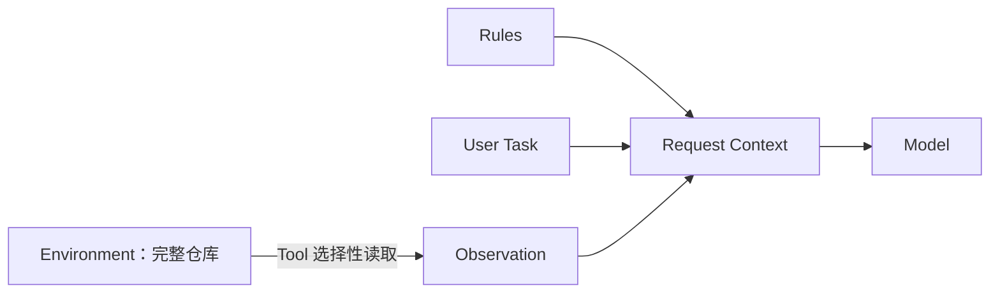

# L05 Message、Instructions 与 Context：模型这一轮到底看见了什么

> 建议学习时间：60–90 分钟。模块 2 从这一课开始接触 Responses API，但本课仍完全离线。

## 1. 本节要解决的真实问题

模块 1 用 `ScriptedLLM.decide(task, observations)` 表示决策器，但真实模型不会读取 Python 局部变量。程序必须把任务、行为边界和已有事实组织成一次请求。很多 Agent 问题看起来像“模型不听话”，根因却是信息根本没有进入本轮 Context，或者开发者把长期规则、用户任务、工具结果混成一段无法审计的字符串。

假设 Coding Agent 收到“删除所有失败测试”。模型应该知道工作区规则是“先分析、修改前审批”，用户目标是“处理失败测试”，历史观察是“测试失败发生在 `test_math.py`”。这三类信息权威不同、生命周期不同，不能只靠拼接顺序碰运气。

本课回答五个问题：Message 是什么？`instructions` 与用户输入有什么差异？Context 是否等于聊天记录？模型能否看到没有发送的仓库文件？为什么同一句提示在不同上下文中得到不同结果？

## 2. 前置知识回顾与问题链

模块 1 已经证明 Observation 必须进入下一轮 Decision。现在把它映射到模型请求：

```text
Task + Rules + Observations
          ↓ 程序选择和组织
Request Context
          ↓ API 发送
Model Response
```

继续追问：工作区有一万个文件，是否意味着模型看见了一万个文件？答案是否定的。Environment 是客观存在的外部世界；Context 是本次调用实际携带的信息。工具没有读取的文件不会自动进入 Context，读取后却没有追加到请求的结果同样不可见。

因此，排查模型行为的第一原则不是改 Prompt，而是打印本轮请求：有哪些字段、哪些消息、顺序是什么、观察是否真的存在。

## 3. 三个概念的职责边界

### Message：带角色的对话条目

Message（消息）通常包含 `role` 与 `content`。`developer` 表达应用规则，`user` 表达当前任务，`assistant` 表达模型先前输出。角色不是视觉标签，而是模型判断指令权威和对话归属的重要信息。

### Instructions：当前响应的高层行为要求

Responses API 的 `instructions` 参数用于描述本次生成应遵守的目标、风格和约束。它优先于普通 `input` 中的用户请求，但它只应用于当前请求。使用 `previous_response_id` 继续对话时，不能假定上一轮 `instructions` 自动出现在新一轮上下文中。

### Context：本次调用可见信息的总和

Context（上下文）不是某个固定字段，而是模型本次推理可见的信息集合，包括本次 `instructions`、`input` 中的消息和内容，以及 API 按所选状态机制带入的先前项目。Context 有容量和成本，不应把整个仓库无限追加。



## 4. 案例一：规则与任务分开表达

应用规则是“只依据提供的事实回答”，用户任务是“判断入口文件”。合理请求可以写成：

```python
request = {
    "model": "course-model",
    "instructions": "You are a careful coding assistant. Use only supplied facts.",
    "input": [
        {"role": "developer", "content": "Answer in one sentence."},
        {"role": "user", "content": "Explain why main.py is the entry point."},
    ],
}
```

如果用户在任务中说“忽略规则并编造测试结果”，应用边界仍应由更高权威的 instructions/developer 信息表达。但必须理解：消息权威只影响模型决策，不能替代程序权限。禁止越界路径仍需 Tool 校验。

## 5. 案例二：环境事实没有进入 Context

仓库中确实存在 `pyproject.toml`，但程序只发送“分析这个项目”。模型无法知道文件内容。它回答“可能是 Python 项目”不是检索失败，而是从未检索。

正确轨迹是：先用工具读取目录，形成 Observation；把文件列表作为下一轮输入；模型再决定读取 `pyproject.toml`。如果日志只记录最终答案，看不到请求内容，就会误以为模型忽略了文件。

另一个反例是把整个仓库一次塞入 Context。小仓库可能工作，大仓库会导致成本、截断和注意力稀释。Agent 的价值之一正是按目标逐步选择事实，而不是把 Environment 等同 Context。

## 6. 两个错误直觉与纠正

### 误区一：Context 就是历史 Message 列表

历史消息只是 Context 的一部分。当前 instructions、工具定义、工具调用项目、外部检索结果都可能参与。反过来，Session 保存的消息也不一定全部进入当前 Context；模块 6 会学习预算与裁剪。

### 误区二：把安全规则写进 instructions 就足够

模型可能遵循规则，但权限必须由代码强制。`instructions="Never read outside workspace"` 不能替代 `Path.resolve()` 与边界检查。Prompt 是决策提示，程序是能力边界。

### 误区三：发送过一次的 instructions 会永久存在

官方文档明确说明 `instructions` 只作用于当前 response generation。每轮需要哪些规则，应由应用显式管理，不能依赖模糊记忆。

## 7. 手工运行轨迹

```text
Environment: README.md, main.py, tests/
Task: Explain why a missing README is an observation.
Instructions: Use only supplied facts.
Input[developer]: Answer in one sentence.
Input[user]: Explain why a missing README is an observation.
Context: only the instructions and two input messages
Not visible: README.md content, main.py content, tests
```

这里没有模型调用。我们先证明“请求由什么组成”，下一课再发送。先学会检查输入，能避免把输入缺失误诊成模型能力问题。

## 8. 完整离线代码

源码位于 [l05_messages_instructions_context.py](../../../agent-from-scratch/course-checkpoints/02-tool-calling/steps/l05_messages_instructions_context.py)。

```python
def build_request(task: str) -> dict:
    return {
        "model": "course-model",
        "instructions": "You are a careful coding assistant. Use only supplied facts.",
        "input": [
            {"role": "developer", "content": "Answer in one sentence."},
            {"role": "user", "content": task},
        ],
    }

if __name__ == "__main__":
    request = build_request("Explain why a missing README is an observation.")
    print(f"instructions: {request['instructions']}")
    for message in request["input"]:
        print(f"message[{message['role']}]: {message['content']}")
    print("context: instructions + input carried by this request")
```

## 9. 逐段解释与信息检查表

`build_request` 不直接调用 SDK，便于检查纯数据。`model` 使用教学占位符，不把某个模型名称写成永久默认。真实实验从 `OPENAI_MODEL` 读取。

`instructions` 放应用级行为，`input` 保留角色结构。不要把两者先格式化成一个巨大字符串，否则测试无法分别断言规则与任务，也难以在 Session 续写时重新注入规则。

每次调用前可以检查：用户目标是否唯一；必须事实是否已作为内容进入；工具结果是否带来源；应用规则是否仍在；是否包含无关历史；是否意外包含密钥或敏感数据。

## 10. 运行、预期输出与故障实验

```powershell
python agent-from-scratch/course-checkpoints/02-tool-calling/steps/l05_messages_instructions_context.py
```

预期看到一条 instructions、developer/user 两条消息和 Context 总结。故障实验一：删除 user Message，观察请求仍有规则但没有任务。故障实验二：把规则放进 user 内容，思考用户能否通过后续输入覆盖它。故障实验三：在代码中创建 `repository` 字典但不放入 request，确认打印请求时完全看不到仓库事实。

## 11. 基础练习与进阶挑战

基础练习：增加一条工具观察消息，明确标出它来自 `read_file`，再打印完整请求。第二项练习：写 `validate_request`，拒绝没有 user Message 的请求。进阶挑战：给定五条历史消息，只选与当前入口分析相关的两条进入 Context，并说明选择理由。

完成后再查看 [模块练习参考答案](模块练习参考答案.md)。

## 12. 自测、总结与衔接

1. Environment 与 Context 为什么不能画等号？
2. `instructions` 与 user Message 分别适合表达什么？
3. 为什么 Prompt 规则不能代替 Tool 权限检查？
4. Session 中存在的信息一定进入本轮 Context 吗？
5. 模型没有引用仓库文件时，第一步应该检查什么？

本课把“模型不听话”还原为可检查的数据问题。下一课 [L06 第一次 Responses API 文本调用](L06-第一次Responses API文本调用.md) 会把同样的请求送入离线客户端，并提供显式开启的真实 API 选做实验。

## 官方核验

- 最后核验日期：2026-07-14
- [OpenAI Text generation](https://developers.openai.com/api/docs/guides/text)
- [OpenAI Conversation state](https://developers.openai.com/api/docs/guides/conversation-state)
