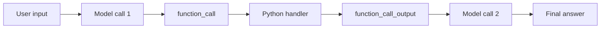

# L08 执行 Tool 并回传结果：完成第一次模型—程序往返

> 建议学习时间：60–90 分钟。本课完成固定两次调用；`while` Agent Loop 留到模块 3。

## 1. 本节要解决的真实问题

模型已返回 `function_call`，但它还不知道函数结果。应用必须执行处理器，把结果包装成 `function_call_output`，使用原 `call_id` 回传，并再次调用模型获得最终自然语言回答。

最容易犯的错误是只发送工具结果、丢掉模型原始 output item。对于需要保留的推理或调用项目，下一次 input 应先追加 `response.output`，再追加工具输出。另一个错误是重新生成 call ID，导致模型无法对应请求与结果。

## 2. 前置回顾与问题链



为什么需要第二次调用？因为 Python 只产生事实，不负责面向用户组织回答。为什么回传字符串？官方协议允许普通文本或 JSON 字符串，模型再解释其含义。

## 3. 数据流的三个不可丢失项

第一是原始模型 output item，它表达模型请求了什么；第二是 `call_id`，关联请求与结果；第三是工具的成功或错误文本。只保留最终答案会失去审计证据，只保留工具结果则模型不知道它对应哪次调用。

```python
input_items.extend(first.output)
input_items.append({
    "type": "function_call_output",
    "call_id": item.call_id,
    "output": output,
})
```

## 4. 案例一：工具成功

`get_current_time()` 返回固定时间 `2026-07-14T09:30:00+08:00`。第二次请求包含 user message、原 function call、function call output。模型最后回答“The current time is 09:30”。固定时间避免测试因运行时刻变化而不稳定。

## 5. 案例二：参数损坏与未知工具

若 arguments 是非法 `{`，程序不能执行 handler。它产生 `error: invalid JSON arguments` 并仍以同一个 call ID 回传，让模型能够向用户解释失败。若名称不存在，则回传 `error: unknown tool`。错误也是 Observation，不能假装空结果。

当前两次调用结构有局限：如果第二次响应又请求工具，函数不会继续执行。这个局限正是 L09 引入 `while` 的理由。

## 6. 错误直觉与反例

### 误区一：工具成功就可以直接把输出给用户

有时可以，但 Agent 协议还需要模型综合多个结果、解释格式和回答原任务。工具输出与最终回答是不同层次。

### 误区二：第二次只发送 function_call_output

缺少原始 function call 会破坏上下文链。代码先 `extend(first.output)`，再追加结果。

### 误区三：异常应该直接吞掉

吞掉后模型只看到没有结果，无法调整。结构化错误文本使失败可观察，但敏感堆栈不应直接泄露。

## 7. 完整运行轨迹

```text
Request 1 input: user asks current time
Response 1 output: function_call(call-08, get_current_time, {})
Python action: get_current_time()
Tool result: 2026-07-14T09:30:00+08:00
Request 2 input[1]: original function_call
Request 2 input[2]: function_call_output(call-08, result)
Response 2 output_text: The current time is 09:30 in Asia/Shanghai.
Finish: fixed round trip completed
```

## 8. 完整代码

核心位于 [responses_core.py](../../../agent-from-scratch/course-checkpoints/02-tool-calling/responses_core.py)，场景位于 [l08_execute_and_return_tool_output.py](../../../agent-from-scratch/course-checkpoints/02-tool-calling/steps/l08_execute_and_return_tool_output.py)。

```python
def run_fixed_tool_round_trip(client, *, model, user_input, tool_handlers):
    input_items = [{"role": "user", "content": user_input}]
    first = client.create(model=model, input=input_items, tools=[time_tool_schema()])
    input_items.extend(first.output)
    tool_outputs = []

    for item in first.output:
        if item.type != "function_call":
            continue
        try:
            arguments = json.loads(item.arguments)
            handler = tool_handlers[item.name]
            output = str(handler(**arguments))
        except json.JSONDecodeError as error:
            output = f"error: invalid JSON arguments: {error.msg}"
        except KeyError:
            output = f"error: unknown tool: {item.name}"
        tool_output = {
            "type": "function_call_output",
            "call_id": item.call_id,
            "output": output,
        }
        input_items.append(tool_output)
        tool_outputs.append(tool_output)

    second = client.create(model=model, input=input_items, tools=[time_tool_schema()])
    return {"answer": second.output_text, "input_items": input_items,
            "tool_outputs": tool_outputs}
```

## 9. 逐段解释

`input_items` 是续写载体，不是 Session。第一次响应的每个 output item先保留。循环只处理 `function_call`，因为 response.output 未来可能包含其他类型。参数解析、名称路由和执行异常分开处理，便于定位。

第二次调用仍传 tools，是为了保持真实协议形状；但本函数无第三轮，所以只适合固定演示。模块 3 会把“调用—判断—执行—追加”放进受限循环。

## 10. 运行、测试与故障实验

```powershell
python agent-from-scratch/course-checkpoints/02-tool-calling/steps/l08_execute_and_return_tool_output.py
cd agent-from-scratch
python -m pytest -q tests/test_course_module2.py
```

故障实验：把 call ID 回传成 `new-id`，观察测试失败；删除 `input_items.extend(first.output)`，检查第二次请求缺什么；让 handler 抛异常，确认错误成为 output；让第二个响应再次请求工具，记录固定两次结构为何无法继续。

## 11. 练习与进阶挑战

基础练习：增加 calculator handler 并处理一个带参数调用。第二项练习：同一第一响应放入两个 function call，验证生成两个对应 output。进阶挑战：在不写 `while` 的前提下说明第三次工具请求为何使代码结构迅速重复。

答案见 [模块练习参考答案](模块练习参考答案.md)。

## 12. 自测、总结与模块衔接

1. 为什么必须保留 `response.output`？
2. `call_id` 与工具名称分别解决什么问题？
3. 工具输出为什么不等于最终回答？
4. 非法 JSON 为什么不应执行处理器？
5. 固定两次调用为何还不是通用 Agent Loop？

模块 2 到此完成从请求、文本响应、工具请求到结果回传的最小闭环，但路径仍固定。下一课 [L09 从固定调用到 while 循环](../模块03-从零实现Agent Loop/L09-从固定调用到while循环.md) 将消除重复调用结构。

## 官方核验

- 最后核验日期：2026-07-14
- [OpenAI Function calling](https://developers.openai.com/api/docs/guides/function-calling)
